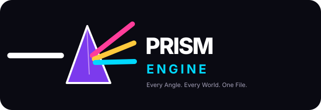

# ◈ PRISM ENGINE

**Every Angle. Every World. One File.** · Android APK only · MIT · offline-first

> **Status: early engine foundation, not a finished Unity-equivalent.** The C++20 core, PrismScript interpreter, math/ECS/jobs, crypto, JSON, render-pipeline planning, audio mixer, game AI, LAN networking with rollback, `.prism` asset container, runtime UI, 2D physics, plus host-tested 3D physics, animation, particles, terrain and scene graph are implemented. The Android runtime host is Kotlin; the APK demo remains a GLES 3 prototype. **Not present:** a Vulkan backend executing the render graph, full graphical IDE, ML, AR, and monetization. The new C++ modules are not yet integrated into the APK runtime. See [feature status](docs/01-architecture.md#implemented-module-by-module).



## Quick start

Host C++20 tests (GCC 12+):

```bash
./build_tests.sh
```

Build the **bundled 2D + 3D demo APK** after preinstalling JDK 17, Gradle 8.9, Android SDK 35, NDK 27.2.12479018 and CMake 3.22.1:

```bash
tools/build-apk.sh debug              # --offline; never downloads
adb install -r android/app/build/outputs/apk/debug/app-debug.apk
# or: tools/build-apk.sh debug --install
```

The GitHub Actions [Android APK](.github/workflows/android-apk.yml) workflow installs provisioning dependencies on a connected runner, runs tests, then builds and uploads `prism-engine-debug-apk`. **No APK is checked into Git.** CI provisioning is online; the local exporter refuses to build if the offline toolchain is absent. Default APK has no INTERNET permission. The APK is a GLES 3 prototype (not Vulkan); left/right touch and jump control the 2D player while a spectral 3D cube rotates beside it. `sample.prism` is parsed and executed by the native VM.

## Repository

| Directory | Purpose |
|---|---|
| `engine/core` | Native C++20 runtime (~15,200 lines): core, math, ECS, jobs, input, script VM, crypto, JSON, render planning, audio, AI, networking, assets, UI, 2D + 3D physics, animation, particles, terrain, scene graph, Android GPU profiling |
| `engine/tests` | Zero-dependency host unit tests (181 tests, 6,974 assertions) |
| `android` | One Android application (Kotlin game host + offline Prism Studio panel shell + JNI + GLES 3 renderer); imports selected assets into private app storage and emits an installable APK |
| `editor/src/PrismEditor` | .NET 8 **CLI starter** for project creation/inspection (not a scene IDE or working custom export) |
| `samples` | Scene/template descriptions for future importer |
| `templates` | Touch layout and offline save/unlock design templates |
| `brand` | SVG logo, Ray mascot, color and typography tokens |
| `docs` | Offline architecture, feature status, diagrams, build & test plan |

## How to contribute

Start with [architecture](docs/01-architecture.md), [APK workflow](docs/03-apk-workflow.md), and [roadmap](docs/10-roadmap.md). Keep Android APK as the sole runtime export. New subsystems use the typed `EventBus` and `ServiceRegistry`; add host tests for every feature. All code MIT; do not add a phone-home or mandatory online SDK.
